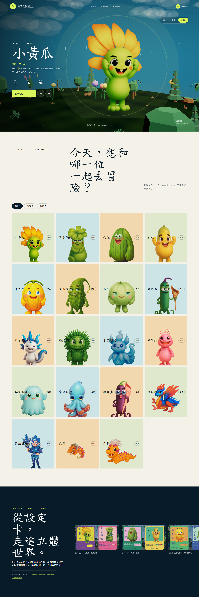
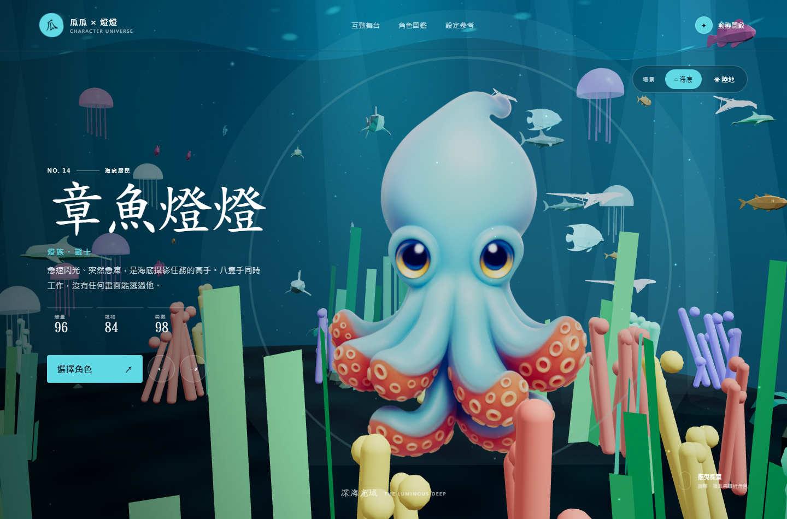

# 瓜瓜家族 × 燈燈王國

使用 three.js 製作的互動式 3D 角色宇宙。可在海底與陸地場景間切換，探索 19 位角色，並查看原始角色設定卡。





## 互動內容

- 19 位角色介紹與角色選擇器
- 海底、陸地雙場景切換
- 可旋轉、縮放的 three.js 舞台
- 角色漂浮、發光、海泡與花粉粒子動畫
- 原始角色卡與造型設定參考區
- 桌面與手機響應式版面

## 本機預覽

這是純靜態網站，可用任何靜態伺服器開啟。請勿直接雙擊 `index.html`，因為瀏覽器會限制 ES Modules 載入。

例如：

```bash
npx serve .
```

## 技術

- three.js 3D 場景、粒子、燈光與相機互動
- 原生 HTML / CSS / JavaScript
- 響應式版面與 reduced-motion 支援
- WebP 圖片最佳化

## 素材

角色圖片與角色設定卡由專案提供的 `3D` 參考資料夾整理與最佳化。

場景模型使用：

- [Kenney Nature Kit](https://kenney.nl/assets/nature-kit) — CC0
- [Quaternius Animated Fish Pack](https://quaternius.com/packs/animatedfish.html) — CC0

完整來源與授權說明請見 [ASSET_LICENSES.md](./ASSET_LICENSES.md)。
